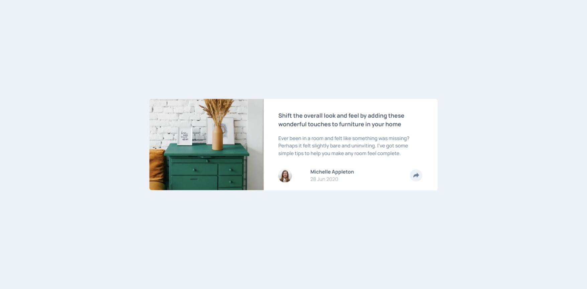
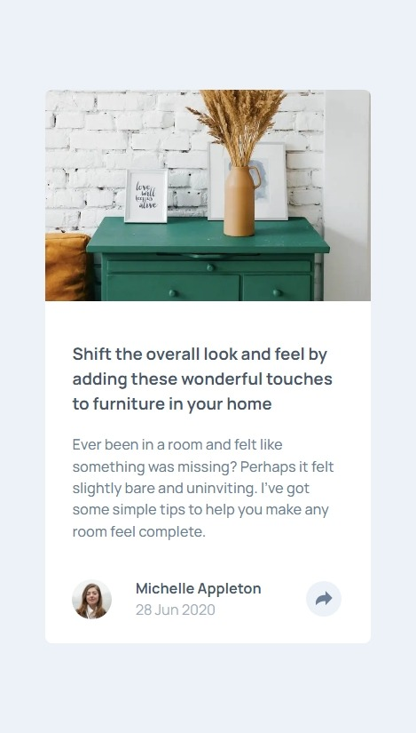

# article-preview-component

### Screenshot

### Links

- Project URL : https://github.com/konraddissake1808/article-preview-component

- Live Site URL: https://article-preview-component-zeta-indol.vercel.app/

### Built with

- Semantic HTML5 markup
- Flexbox
- Mobile-first workflow
- [React](https://reactjs.org/) - JS library
- [Next.js](https://nextjs.org/) - React framework

### What I learned

     This project made me learn how to better handle event listening on Next.js, use SVGR to import SVGs, and play around with all that has to be learned about Next.js.

## Author

- Github - [@konraddissake1808](https://github.com/konraddissake1808)
- Frontend Mentor - [@konraddissake1808](https://www.frontendmentor.io/profile/konraddissake1808)